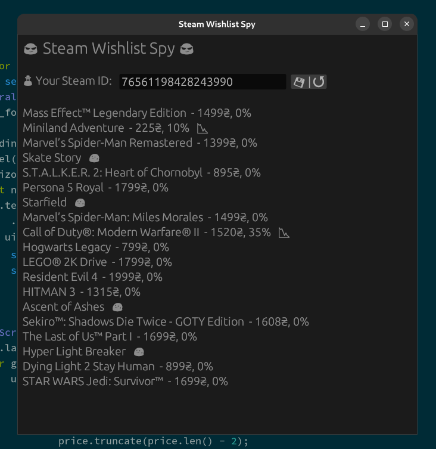

# 🕵️‍♂️ Steam Wishlist Spy 🕵️‍♂️

A program that allows you to keep track of your [Steam] wishlist.
Written in [Rust].

### ❗️ Prerequisites ❗️

For the program to work, you need to make your profile public:

1. First, launch `Steam` Client. You may also use the `Steam` web.
2. Navigate to your profile name > `View my profile`.
3. Now, click the `Edit Profile` button.
4. Go to the `Privacy Settings` menu.
5. Set My profile as `Public`.

[Steam]: https://store.steampowered.com
[Rust]: https://www.rust-lang.org
